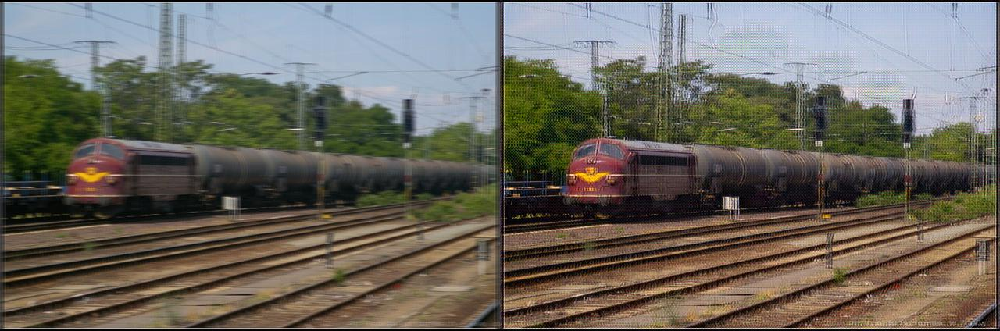

# a Keras implementation to deblur images，Inspired by [https://github.com/lengstrom/fast-style-transfer] (https://github.com/lengstrom/fast-style-transfer)

this repo try to convert blurry image to the corresponding sharp estimate, such as:

## Dataset
get [imagenet-vgg-verydep-19.mat](https://pan.baidu.com/s/13PMasGCw6LDoa3r64oVIGQ)
get the [blur and sharp images](https://pan.baidu.com/s/1xGfIhglsZ_pAW-ZF5Q5L5g) 

## Training

python train.py

## Testing

get [model](https://pan.baidu.com/s/1mBrHo5qXbP17cF_43-huug)
python evaluate.py